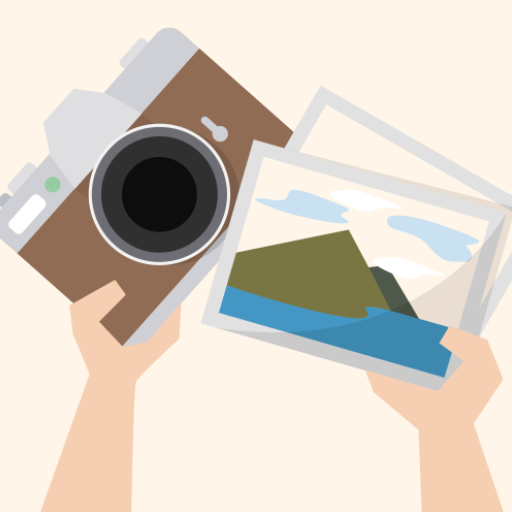

# Image Gallery
Repository for the final project of the course MOBILE DEVELOPMENT - 101805 (year 2020/2021)

  
  
Designed by rawpixel.com / <a href="http://www.freepik.com">Freepik</a>

## Brief description and some screenshots

A gallery app which allows the user to take pictures from the camera and manage them in different albums. It is possible to view details regarding the images as well as performing operations on them: delete, share, move, rotate, etc... The app also provides a map that shows the location were the pictures were taken. Each album is represented as a folder inside the public external storage, since all these data should remain available even after uninstalling the app.

<table>
  <tr>
    <th>Main Activity</th>
    <th>Gallery Activity</th>
    <th>Map Activity</th>
  </tr>
  <tr>
    <td></td>
    <td></td>
    <td></td>
  </tr>
    <tr>
    <th>Map Activity</th>
    <th>Album Activity</th>
    <th>Show Image Activity</th>
  </tr>
  <tr>
    <td></td>
    <td></td>
    <td></td>
  </tr>
</table>

## Project structure
The project consists of 8 activity and various utility classes divided in 4 packages:
- **Async Package**: Which contains only classes that extends *AsyncTask* for various operations.
- **Dialogs Package**: Which contains a wide selection of *DialogFragment* with their respective *Listeners* for callback operations.
- **Grid Views Package**: Which contains the two *Adapter* classes used by the *Grid Views* on the *Gallery Activity* and *Album Activity*.
- **Utilities Package**: Which contains *PhotoManager* and *QueryManager*, two classes with the purpose of managing all my frequent operations on the *ContentResolver*. The other 4 classes defined in this package are used to store the data retrieved by the *QueryManager*.

## Main Activity

<b>User Interface:</b> The Main Activity is one of the simplest activities inside the project. The Layout consists of a logo with 4 buttons that lead to different activities.

<b>Implementation and Behavior:</b> When the activity starts it retrieve the Shared Preferences called USER_PREFERENCES, which contains most of the settings the user can provide. Then the Main Activity check the state of the PREF_DARK_MODE boolean, if it is true then the activity will be reconstructed by calling the static method AppCompatDelegate.setDefaultNightMode() and using the dark theme, otherwise it will use the default system specifics (Dark Mode only when the phone is set to Night Mode).

The Main activity is also interested in the PREF_CAPTURE_ALBUM which specify the album where all the photos taken from the Main Activity need to be stored. This value is null when there is no album, but if the user try to take a photo without creating an album the activity will use the DEFAULT_ALBUM value (which is Camera) and
update the PREF_CAPTURE_ALBUM with that value. All the buttons define an explicit intent that lead to another activity, among them the Capture button is the only one that start an activity (Photo Capture Activity) for a result.

## Photo Capture Activity

<b>Implementation and Behavior:</b> This activity has no layout and just help managing all the different steps performed each time another activity want to take a photo. This activity takes an extra parameter ALBUM_NAME which contains the name of the album where the activity needs to store the new photo.

<ul>
<li>Upon its creation this activity retrieves the PREF_GEO_TAG boolean from the Shared Preferences (default value true), this value specify if the user want to add location information to the new photo.</li>
<li>Then the activity starts by checking the fundamental permissions for the behavior of the activity, which are the CAMERA ACCESS and WRITE EXTERNAL STORAGE, if these permissions are not granted it will request them to the user. If the user doesn’t grant us these fundamental permissions the activity will end with a Toast message and a RESULT_CANCELD.</li>
<li>Then the activity checks the optional permissions (if PREF_GEO_TAG is set to true), which are ACCESS FINE LOCATION and ACCESS MEDIA LOCATION (only for API> 29), if the user doesn’t grant us these optional permissions or if the location manager is disabled the activity will continue without geotagging the new photo.</li>
<li>At this point the activity checks if the external storage is available and create a new file (with a collision resistant file name) using the Photo Manager, then it passes the URI to the implicit intent ACTION IMAGE CAPTURE as EXTRA OUTPUT and start the activity for a result.</li>
<li>On the results if the activity gets a RESULT_OK it will store location information (if needed) and finish with the same result, otherwise it will remove the file previously created and then finish with RESULT_CANCELED.</li>
</ul>

##Show Image Activity

<b>User Interface:</b> The Layout consist of a single Image View that can be manipulated (zoom, translation) and 4 buttons that perform different actions. The App Bar contains two actions that perform a rotation on the image.

<b>Implementation and Behavior:</b> This activity takes 2 extra parameters: IMAGE_URI which contains the URI of the image to show and IMAGE_ID which contains the ID that the Content Resolver use to identify a media content. When the activity is created, we have the usual checks relative to the external storage (permissions and availability). Then the activity load the image by setting the URI inside the Zoomage View, which is a custom class (created by <a href="https://github.com/jsibbold/zoomage">Jeff Sibbold</a>) that extends Image View and manage all the most common actions performed by the user (zoom when double tapping or scaling and translation when dragging).

Then the activity retrieves all the details of the image with the help of the Query Manager. All these data are stored inside an ImageDetails object and are shown to the user with a Dialog whenever he presses the Info Button.

## Photo Map Activity

<b>User Interface:</b> The layout consists of a single Map View with some custom markers located in the position where photos were taken. Whenever the user clicks on a marker a Dialog is shown, from that dialog it’s possible to explore all the images taken in the surrounding area.

<b>Implementation and Behavior:</b> The Photo Map Activity use the Osmdroid library which is a free replacement for the Google Map API. Upon the start of the activity we need to check the availability of the external storage and as always, the permissions. This time the permissions required for the activity to work properly are:

<ul>
<li><b>INTERNET ACCESS:</b> to download the map tilesets from the Osmdroid server.</li>
<li><b>EXTERNAL STORAGE ACCESS: to create a cache for the tilesets.</b></li>
<li><b>MEDIA ACCESS LOCATION (Only API 29+): to access the location metadata on the Exif Interface object.</b></li>
</ul>

If one of these permissions is not granted and the user decide not to grant it then the activity is closed, and a Toast message is shown. After this check the Photo Map Activity retrieves a collection of ImageLocation objects using the Query Manager and build the markers on the map. Each ImageLocation object contains all the IDs and URIs of photos in range of 100 meters. The image thumbnail used on the marker is last photo taken near that area. For this operation the Query Manager ignores all the images that don’t have location metadata.

After the markers has been placed on the map, the activity will try to zoom to show all the markers. For doing that, it’s necessary to create a Bounding Box object that locate the coordinates to show starting from a list of Geo Points. When the user clicks on a marker the activity shows a Dialog with a Grid View inside (similar to the one used in the Gallery and Album activities) that contains all the photos taken near that marker. From this dialog it is possible to go to the corresponding Show Image Activity.

